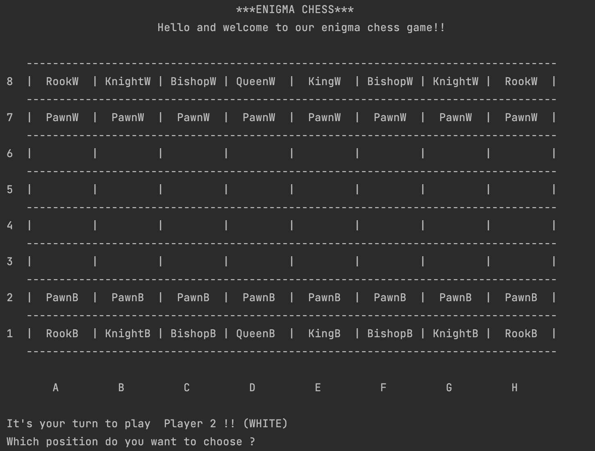

# Chess Game (ASCII)


---

## Overview

**Chess-MVC** is a modern Java implementation of the classic **Chess game**.  
The project follows the **MVC (Model-View-Controller)** design pattern, ensuring a clean separation of concerns, modularity, and testability.  
It includes object-oriented modeling of chess rules, pieces, and game mechanics, supported by unit tests.

---

## Project Description 

**Chess-MVC is a Java-based implementation of the classic board game Chess. Built with Maven and following the MVC architecture, it models the game logic, board, and pieces using OOP principles. It provides a text-based view, modular design, and unit tests, serving as both an educational tool and a playable game.**

---

## Architecture

The project is structured as follows:

```
Chess/
│── src/
│   ├── main/java/chess/
│   │   ├── controller/Controller.java
│   │   ├── model/
│   │   │   ├── Board.java, Game.java, GameState.java, Player.java
│   │   │   ├── Position.java, Square.java, Color.java, Direction.java
│   │   │   └── Pieces/ (Pawn, Rook, Knight, Bishop, Queen, King)
│   │   └── view/ (TextView.java, View.java)
│   ├── test/java/chess/ (JUnit tests)
│── pom.xml
```

### Class Diagram (simplified)

```
+-----------------+       +------------------+
|   Controller    |<----->|      View        |
+-----------------+       +------------------+
         |
         v
+-----------------+       +------------------+
|      Game       |<----->|      Board       |
+-----------------+       +------------------+
         |                         |
         v                         v
+-----------------+       +------------------+
|     Player      |       |     Piece        |
+-----------------+       +------------------+
                                 |
            --------------------------------------------
            |       |       |       |       |         |
        +------+ +------+ +-------+ +------+ +------+ +------+
        | Pawn | | Rook | | Knight| |Bishop| |Queen | | King |
        +------+ +------+ +-------+ +------+ +------+ +------+
```
---
# Visuals


---

## Installation & Build

### Requirements
- **Java 11 or later**
- **Apache Maven**

### Build Instructions

```bash
# Clone the repository
git clone https://github.com/yourusername/Chess-MVC.git
cd Chess-MVC

# Build with Maven
mvn clean install
```

### Run the game
```bash
mvn exec:java -Dexec.mainClass="chess.main.main"
```

### Run tests
```bash
mvn test
```

---

## Features

- Fully functional **Chess game logic**
- Implementation of all chess pieces with legal moves
- **Game state tracking** (check, checkmate, stalemate)
- **Text-based view**
- Modular **MVC design**
- Unit tests for critical components

---

## Author

Developed by **Alec Waumans**  
Student in **Industrial Computer Science**  

---

## License

This project is licensed under the **MIT License**.  
You are free to use, modify, and distribute it, provided that proper credit is given.  

For full license details, see the [LICENSE](LICENSE) file.

---

## Acknowledgments

- Inspired by the classic game of **Chess**  
- Thanks to the Java and open-source communities for tools and testing frameworks
